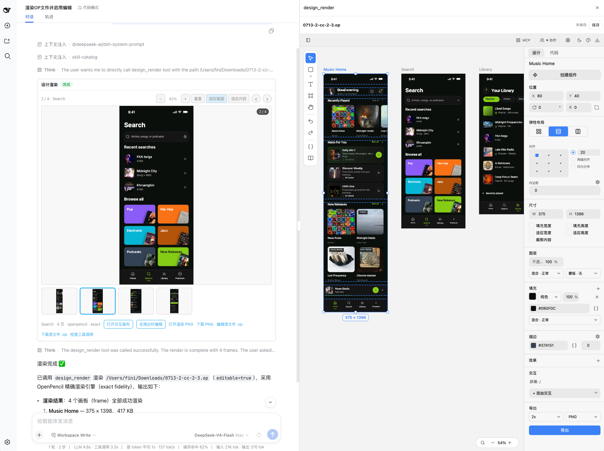

# DSH OpenPencil

DeepSeek Harness plugin for previewing and editing OpenPencil `.op` documents inside a conversation.



## 项目介绍

**中文**

DSH OpenPencil 是连接 DeepSeek Harness 与 OpenPencil 的智能设计插件，目标是让 Agent 直接驱动真实、可编辑、可交互的设计画布，而不是只返回一张生成图片。它支持在对话中渲染和浏览多页面 `.op` 设计稿，一键进入可缩放画布或完整编辑器（在支持的 DSH 中使用原生右侧详情栏；官方 rc.2/rc.5 则自动回退到插件自有的可缩放右侧工作台，并可切换全屏），继续使用 OpenPencil 的图层、属性、绘制、组件、交互和多类模板能力，快速创建 App 页面、演示文稿、社交媒体内容、信息图等不同类型的设计；同时让 DeepSeek Harness 中的 Agent 理解画布结构、节点、选区、组件关系与交互逻辑，直接调用模板、生成页面、修改组件、调整布局、编排交互、检查视觉质量并保存结果，把“对话提出需求—Agent 操作真实画布—实时预览与交互验证—继续迭代”整合成一条完整设计工作流。

**English**

DSH OpenPencil is an intelligent design plugin that connects DeepSeek Harness with OpenPencil. Its goal is to let an Agent directly operate a real, editable, and interactive design canvas instead of returning only a generated image. It can render and browse multi-page `.op` designs inside a conversation, then open them in a zoomable canvas or the full editor. Hosts with the native Tool-details seam use DSH's right-hand details panel; the published rc.2/rc.5 hosts automatically fall back to the plugin's resizable right-hand workbench, which can also switch to full screen. From there, users retain OpenPencil's layers, properties, drawing tools, components, interactions, and broad template library for creating app screens, presentations, social media content, infographics, and more. At the same time, the Agent can understand the canvas structure, nodes, selections, component relationships, and interaction logic; invoke templates; generate pages; modify components; adjust layouts; orchestrate interactions; inspect visual quality; and save the result. This brings requirement gathering, direct Agent-driven canvas editing, live preview and interaction validation, and continued iteration into one complete design workflow.

## What works

- `openpencil_render` creates an immutable, content-addressed `.op` snapshot and renders every top-level frame on the active page.
- `openpencil_selection` reads the exact nodes selected in the live editor canvas.
- `openpencil_new` creates a brand-new `.op` from one transactional `batch_design` program, saves it atomically through DSH's sandboxed filesystem, and requires no pre-opened editor.
- `openpencil_create` applies a transactional OpenPencil `batch_design` program to generate or restructure canvas nodes.
- `openpencil_edit` modifies an explicit node or the single node selected by the user.
- OpenPencil's installed headless exporter is the default, design-fidelity renderer.
- The tool card shows the first top-level frame as a large replay-safe PNG. Multi-frame documents add a horizontally scrollable thumbnail rail, click-to-select, and previous/next navigation.
- The large preview supports manual zoom, reset, fit-frame, and fit-content modes.
- “Open interactive canvas” lazily mounts the read-only OpenPencil Web SDK. The canvas supports pan, zoom, and fit.
- With `editable: true`, the edit action opens the managed OpenPencil editor with selection, layers, properties, drawing tools, undo/redo, and explicit save semantics. It prefers DSH's native Tool-details sidebar and falls back to a resizable plugin-owned right workbench on published rc.2/rc.5; smaller viewports use full screen automatically.
- The tool card and managed editor follow DSH's Chinese/English locale and light/dark theme without reloading the editing session.
- Image and document grants are signed, hash-bound capabilities. Browser metadata does not expose an arbitrary host path.
- If the exact OpenPencil binary is genuinely unavailable, Jian may produce a clearly labelled `runtime-preview` fallback. Exact renderer failures, timeouts, and invalid PNGs do not silently fall back.

The read-only Web SDK viewer and the managed editor are intentionally separate paths. Only one Web SDK viewer and one managed editor are active at a time because their current browser hosts own page-wide render pumps. “Edit source .op” remains available as a direct DSH file action.

## Install into DSH

Use an authenticated DSH prerelease without installing it globally:

```sh
git clone git@github.com:dsh-external/dsh-openpencil.git
npx --yes -p @deepseek-ai/dsh@0.0.1-rc.5 \
  dsh plugin --profile web add /absolute/path/to/dsh-openpencil
npx --yes -p @deepseek-ai/dsh@0.0.1-rc.5 dsh web
```

Keep the private registry credential in a user-level or temporary npm config outside the checkout. This repository intentionally contains no registry credentials.

## Rendering contract

`openpencil_render` accepts a `.op` path, an optional `scale` (`0 < scale <= 8`, default `1`), and optional `editable` (`false` by default). Leave `width` and `height` unset for the exact OpenPencil path: they describe a runtime viewport, not design export dimensions, and are accepted only by the lower-fidelity Jian fallback.

OpenPencil binary discovery checks, in order:

1. `DSH_OPENPENCIL_BINARY` or `DSH_OPENPENCIL_DESKTOP`
2. `/Applications/OpenPencil.app/Contents/MacOS/openpencil-desktop`
3. `~/Applications/OpenPencil.app/Contents/MacOS/openpencil-desktop`
4. `openpencil-desktop` on `PATH`

Jian fallback discovery uses `DSH_OPENPENCIL_JIAN`, a known local release build, then `PATH`.

## Web viewer assets

DSH serves only `client.js` for a client plugin, so the OpenPencil ESM SDK, its WASM, and CanvasKit are staged as explicit same-origin assets:

```sh
npm run sync:viewer-assets
```

The sync command defaults to a sibling `../openpencil` checkout. Override it with `OPENPENCIL_ROOT` or `--openpencil-root`. A complete prebuilt asset directory can be selected with `DSH_OPENPENCIL_VIEWER_SOURCE`. Runtime lookup can be overridden with `DSH_OPENPENCIL_VIEWER_ASSET_DIR`.

Viewer assets are lazy-loaded only after the user opens the canvas. If they are absent or invalid, PNG preview remains available and no canvas button is advertised.

## Managed editor

Editable sessions use OpenPencil's managed web host, the same architecture used by `op-vscode`. The plugin starts the host only after an authorized user action, keeps the daemon token in memory, validates iframe source and origin, and closes the process when the editor session ends. The editor surface is selected progressively: native Tool details when the host declares that seam, otherwise the plugin's right-hand workbench with resize and full-screen controls.

If DSH reloads or unloads the plugin while the canvas is dirty, the host keeps an opaque local recovery draft for up to seven days. Reopening the same source asks before restoring it into the live canvas; recovery never overwrites the `.op` file until the user explicitly saves.

Binary and source discovery can be overridden with:

- `DSH_OPENPENCIL_EDITOR_BINARY` for `op-host-web-server`;
- `DSH_OPENPENCIL_SOURCE_ROOT` (or `OPENPENCIL_SOURCE_ROOT`) for the web bundle and CanvasKit assets.

Saves use an optimistic source hash, an atomic replace, and a successor capability. If the source changes outside the editor, the plugin reports a conflict instead of overwriting it.

## Build and verify

```sh
npm run sync:viewer-assets
npm run build
npm run test:viewer-assets
npm run test:client
npm run test:host -- /absolute/path/to/design.op 375 1091
```

Builds require Node 24.11 or newer. DSH host/client packages are peer dependencies supplied by the target DSH profile. Build tools are resolved from local dev dependencies, the active linked DSH checkout, or an installed DSH source bundle; `DSH_SOURCE_ROOT` can select a source checkout explicitly. The lockfile pins standalone public build tooling when that environment is provisioned separately.

For a private DSH prerelease, keep the issued npm credential outside this repository (for example in a user-level or temporary `.npmrc`) and run the requested version directly:

```sh
npx --yes -p @deepseek-ai/dsh@0.0.1-rc.5 dsh web
```

Never commit `.npmrc`, `NPM_TOKEN`, or copied registry credentials. This repository ignores local npm configuration by default.

`test:host` performs a real exact render, validates PNG IHDR geometry and SHA-256, exercises immutable image/document capabilities over HTTP, and checks that viewer assets are grantable. The expected dimensions are fixture-specific.

## Result metadata

The model-visible result stays plain JSON. Browser-only `presentationMeta.$dshOpenPencil` carries additive grants for:

- `image`: PNG path, preview/download URLs, and real width/height;
- `frames`: every exact-rendered top-level frame in active-page order, including its node id/name/index and signed PNG URLs;
- `document`: source action path plus immutable snapshot URL, bytes, and SHA-256;
- `viewer`: revisioned SDK/WASM/CanvasKit URLs when the asset route is attached.
- `editor`: scoped launch/refresh capabilities when `editable: true` is authorized.

The result also records `renderer`, `rendererBinary`, `fidelity`, and any warnings. Existing PNG-only schema-v1 messages remain renderable.

Published rc.2/rc.5 do not persist browser presentation metadata for tools nested under PTC/Code Mode. The plugin recovers that UI-only projection through a same-origin, session-bound endpoint: the browser sends only the session id, call id, and immutable document SHA-256, while the host resolves the authoritative result from the durable DSH session log and uses a short-lived in-process marker only to authorize recent live editing. Signed preview/editor capabilities never enter the canonical tool result or model context. Durable history can restore read-only previews; editor grants are issued only for recent, trusted live results.

For bounded replay, nested metadata recovery accepts up to 128 top-level frames; larger Code Mode results remain available through their canonical JSON fallback.

## Agent design workflow

For a natural-language request with no existing document, the Agent should call `openpencil_new` with a new workspace-relative `.op` path and the first complete `batch_design` program. The tool runs that program in a private managed OpenPencil daemon and publishes the authoritative document only after the whole batch succeeds. It never overwrites an existing path and a failed batch leaves no empty file behind. The Agent should then call `openpencil_render` with the returned path and `editable: true` to present the gallery and editor.

Use `openpencil_create` and `openpencil_edit` only for an existing live canvas. Their edits remain unsaved until the editor Save action.

## Current limits

- Follow-up edits to an existing canvas require an already-open managed editor. Changes remain unsaved until the user invokes its Save action.
- The lightweight Web SDK canvas is read-only; full editing uses the separate managed editor surface (native details sidebar when available, resizable right workbench with a full-screen option on published rc.2/rc.5).
- The exact gallery covers top-level frames on the active page; the interactive canvas remains the way to inspect inactive pages and nested nodes.
- Render and snapshot caches still need a product-level retention policy.
